# Robotics Distributed System Exercises


- [Robotics Distributed System Exercises](#robotics-distributed-system-exercises)
    - [Assignment:](#assignment)
    - [Exercise 1:](#exercise-1)
      - [Launchfile instructions](#launchfile-instructions)
      - [Commenting the code](#commenting-the-code)
      - [Results](#results)
    - [Exercise 2:](#exercise-2)
      - [Launchfile instructions](#launchfile-instructions-1)
      - [Making the Dynamic_reconfigure tool work](#making-the-dynamicreconfigure-tool-work)
          - [In the CMakeList:](#in-the-cmakelist)
          - [In Package.xml:](#in-packagexml)
      - [Creating the custom message](#creating-the-custom-message)
      - [Commenting the code: client.py](#commenting-the-code-clientpy)
      - [Results](#results-1)
    - [Exercise 3:](#exercise-3)
      - [Launchfile instructions](#launchfile-instructions-2)
      - [Commenting the code](#commenting-the-code-1)
      - [Results](#results-2)
    - [Exercise 4:](#exercise-4)
      - [Launchfile instructions](#launchfile-instructions-3)
      - [Commenting the code](#commenting-the-code-2)
      - [Results](#results-3)
          - [Note](#note)
    - [Exercise 5:](#exercise-5)
      - [Libraries used](#libraries-used)
      - [Potential field method](#potential-field-method)
      - [The Potential field parameters](#the-potential-field-parameters)
      - [Results](#results-4)
    - [Note:  building the package](#note-building-the-package)
  


### Assignment:


- [X] Using the turtlesim node, visualize the position of the turtle on rviz while controlling it with the teleop node.

- [X] Write a high level controller that takes as input a custom message for linear velocity and angular velocity and generates a saturated control on the /turtle1/cmd_vel topic. The saturation parameters must be set as node parameters. The request and the saturated command must be visualized on rqt_plot.
  
- [x]  Setting the initial position of the turtle at the center of the map, control the turtle with a random control in linear and angular velocity such that the movement is limited to the bottm half of the map.

- [x]  Generate 4 turtles on the map, and control them one at a time such that they move towards the baricenter of the turtles.

- [x]  Generate 3 turtles. Control the first from a starting point to a goal with a control at 50 hz such that it avoids collision with the other two static turtles. 


*****


### Exercise 1:

#### Launchfile instructions

To launch the code:
```
roslaunch dynamic_tutorials first_exercise.launch
```

The launch file is the following:

```
<launch>
    <node pkg="turtlesim" type="turtlesim_node" name="sim"/>
    <node pkg="turtlesim" type="turtle_teleop_key" name="teleop" output="screen"/>
    <node name="turtle1_tf_broadcaster" pkg="dynamic_tutorials" type="tf_broadcaster.py" respawn="false" output="screen" >
    </node>
    <node name = "rviz" pkg = "rviz" type = "rviz" output = "screen" args="-d $(find dynamic_tutorials)/config/tf.rviz" />
</launch>
```

The launchfile launches turtlesim_node, the teleop_node, rviz with a custom configuration file and the actual python snippet that publishs the pose.

#### Commenting the code

```
def handle_turtle_pose(msg):
    br = tf.TransformBroadcaster()
    br.sendTransform((msg.x-5.5, msg.y-5.5, 0),tf.transformations.quaternion_from_euler(0, 0, msg.theta),rospy.Time.now(),'/turtle1',"map")
```
```
if __name__ == '__main__':
    rospy.init_node('turtle_tf_broadcaster')
    rospy.Subscriber('/turtle1/pose',turtlesim.msg.Pose,handle_turtle_pose)
    rospy.spin()
```

The first exercise is straightforward: it uses a tf.TransformBroadcaster object and sends a tf transformation every time that a message is recieved in the /turtle1/pose topic, calling the handle_turtle_pose callback.

#### Results

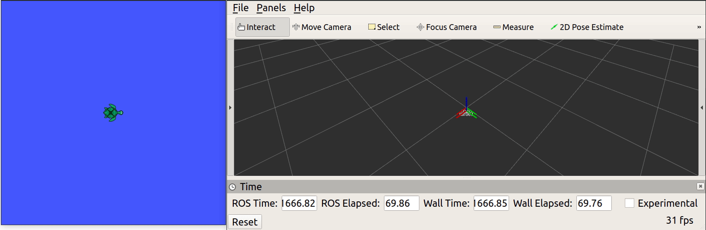


***********************

### Exercise 2:

#### Launchfile instructions

To launch the code:
```
roslaunch dynamic_tutorials second_exercise.launch
```

The launchfile is the following:

```
<launch>
    <node pkg="turtlesim" type="turtlesim_node" name="sim"/>
    <node pkg="turtlesim" type="turtle_teleop_key" name="teleop" output="screen"/>
    <node pkg="dynamic_tutorials" type="client.py" name='controller' output="screen"/>
    <node name="rqt_gui" pkg="rqt_gui" type="rqt_gui"/>
</launch>
```

The second exercises uses rqt to publish commands, dynamic_reconfigure to be able to dynamically reconfigure ros parameters, and the usual turtlesim and teleop nodes.

#### Making the Dynamic_reconfigure tool work

Making dynamic reconfigure work well was more troublesome than expected. Dynamic reconfigure has to be configured well in the CMakeList and in the package.xml file.


 ###### In the CMakeList:
 1. It must be included in the packages.
```
find_package(catkin REQUIRED COMPONENTS
  dynamic_reconfigure
  rospy
  std_msgs
  message_generation
)
```
2. The cfg message must be included in the existing messages.
```
generate_dynamic_reconfigure_options(
   cfg/Tutorials.cfg
 )
```
3. The dependencies must be added properly even if they are python executables.
```
add_executable(dynamic_tutorials_server src/server.py)
add_executable(dynamic_tutorials_client src/client.py)
add_dependencies(dynamic_tutorials_server ${PROJECT_NAME}_gencfg)
add_dependencies(dynamic_tutorials_client ${PROJECT_NAME}_gencfg)

set_target_properties(dynamic_tutorials_server PROPERTIES LINKER_LANGUAGE CMAKE_py_LINK_EXECUTABLE)
set_target_properties(dynamic_tutorials_client PROPERTIES LINKER_LANGUAGE CMAKE_py_LINK_EXECUTABLE)
```

###### In Package.xml:
```
 <build_depend>dynamic_reconfigure</build_depend>
 <run_depend>dynamic_reconfigure</run_depend>
```


The cfg custom message must follow this convention:
```
PACKAGE = "dynamic_tutorials"
from dynamic_reconfigure.parameter_generator_catkin import *
gen = ParameterGenerator()

gen.add("sat_x", double_t,0,"Sat x",1,-5.5, 5.5)
gen.add("sat_rot",double_t,0,"Sat rot",1,-5.5, 5.5)

exit(gen.generate(PACKAGE, "dynamic_tutorials", "Tutorials"))

```

The custom parameters that will be dynamically reconfigured are: sat_x and sat_rot, respectively saturation on linear and angular velocity.


#### Creating the custom message

In order to create a custom message the CmakeList and the Package.xml must be modified in order to generate the message correctly. The message must then be imported and used as type for the subscriber.


```

add_message_files(
    FILES
    Vel.msg
  )


generate_messages(
  DEPENDENCIES
  std_msgs
)
```


```
from dynamic_tutorials.msg import Vel

...

        self.sub=rospy.Subscriber("vel_cmd", Vel, self.callback)

```


#### Commenting the code: client.py

The dynamic configure cfg message must be imported properly.

```
# Give ourselves the ability to run a dynamic reconfigure server.
from dynamic_reconfigure.server import Server as DynamicReconfigureServer
# Import custom message data and dynamic reconfigure variables.
from dynamic_tutorials.cfg import TutorialsConfig as ConfigType
``` 
The Object oriented paradigm has been used for making the code more functional.


The code is organized in a FirstExercise class and in a main function.

The FirstExercise class has:

1. Init function where publisher and subscriber are defined.

```

class First Exercise(object):

    def __init__(self):
        
        # Initialize the node and name it.
        rospy.init_node('controller')

        # Define custom msg
        self.sat_x = rospy.get_param('~sat_x', 1.0)
        self.sat_rot = rospy.get_param('~sat_rot', 1.0)
        self.vel_command= Twist()

        # Create a dynamic reconfigure server.
        self.server = DynamicReconfigureServer(ConfigType, self.reconfigure_cb)

        # Create a publisher for our custom message.
        self.pub = rospy.Publisher('turtle1/cmd_vel', Twist, queue_size=25)
        self.sub=rospy.Subscriber("vel_cmd", Vel, self.callback)


        # Create a timer to go to a callback at a specified interval.
        self.rate=rospy.Rate(10)
```

2. Callback function that recieves the data from vel_cmd topic, applies the saturation and publish it in turtle1/cmd_vel topic.

```
    def callback(self, data):
        self.vel_command.linear.x=data.linear_vel
        self.vel_command.angular.z=data.angular_vel

        rospy.loginfo('%d, %d, %d',data.x, data.y, data.z)
        
        if abs(self.vel_command.linear.x)>self.sat_x:
            self.vel_command.linear.x=math.copysign(self.sat_x, self.vel_command.linear.x)
        if abs(self.vel_command.angular.z)>self.sat_rot:
            self.vel_command.angular.z=math.copysign(self.sat_rot, self.vel_command.angular.z)
        # rospy.loginfo('Sat Param is '+str(saturation_rot))
        self.pub.publish(self.vel_command)

```

3. The dynamic_reconfigure callback that assign the new parameters for the saturation

```
    def reconfigure_cb(self, config, dummy):
        """Create a callback function for the dynamic reconfigure server."""
        # Fill in local variables with values received from dynamic reconfigure
        # clients (typically the GUI).
        self.sat_x = config["sat_x"]
        self.sat_rot = config["sat_rot"]
        return config
```
The function math.copysign has been used to preserve the sign during the saturation.

The Main function just calls the class and the rospy.spin() to keep the node running.


What happens in the gif is that 3 and 4 are respectively published in the topic /vel_cmd. These messages are republished in the correct topic: /turtle1/cmd_vel after the saturation is applied. The saturation uses the dynamically updating parameters from the dynamic reconfigure rqt plugin in the bottom left of the image.

#### Results

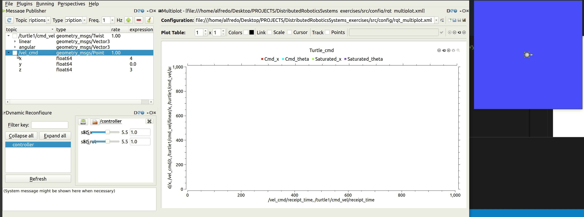

********************

### Exercise 3:

#### Launchfile instructions

To launch the code:
```
roslaunch dynamic_tutorials third_exercise.launch
```

The launchfile is the following:

```
<launch>
    <node pkg="turtlesim" type="turtlesim_node" name="sim"/>
    <node pkg="turtlesim" type="turtle_teleop_key" name="teleop" output="screen"/>
    <node name="command_publisher" pkg="dynamic_tutorials" type="random_controller.py" output="screen" clear_params="true" />
</launch>
```

It launches the random_controller.py executable.


#### Commenting the code

The code follows the OOP paradigm and has 4 main components. The main class is the Turtle object.

1.

```
class Turtle(object): 

    def __init__(self):
        
        self.sub=rospy.Subscriber("turtle1/pose", Pose, self.callback)
        self.pub = rospy.Publisher('/turtle1/cmd_vel', Twist, queue_size=0)
        
        self.rate = rospy.Rate(0.1) # hz
        
        self.vel_command= Twist()
        
        self.null_command=Twist()
        self.null_command.angular.z=0
        self.null_command.linear.x=0
        self.pose=Pose() 
        self.yf=5.5
   
```
Publisher and subscriber are initialized, as well as messages and other utilities.


2. sample function
This function is the core of the code, as it predicts the final position of the turtle which is applied if and only if the final value of Yf is less or equal than 

In order to calculate the value, basic trigonometry is used. 
```

    # Predict final Yf
    def sample(self):
        self.vel_command.linear.x=random.uniform(-3,3)
        self.vel_command.angular.z=random.uniform(-3,3)
        self.yf=self.pose.y+self.vel_command.linear.x/self.vel_command.angular.z*(math.cos(self.pose.theta)-math.cos(self.pose.theta+self.vel_command.angular.z))
```
1. The Move function publish a random command if the sample function return a value less or equal than 5.5.
 ```
    # Move if predicted yf is below 5.5
    def move(self):
        # rospy.loginfo('Vel commands are: %f,%f',vel_command.linear.x,vel_command.angular.z)
        rospy.loginfo('Initial Position is: %f',self.pose.y)
        self.sample()
        while (self.yf>=5):
            self.sample()
        rospy.loginfo('Predicted Position is: %f', self.yf)
        self.pub.publish(self.vel_command)
        rospy.sleep(1)
        self.pub.publish(self.null_command)
        rospy.loginfo('Final position is: %f',self.pose.y)  
```


1. The callback to update the pose data.

```
    def callback(self,data):
        self.pose=data    
```

Finally we have the main function where the class is initialized.

```
if __name__ == "__main__":
    rospy.init_node('random_command_publisher')   
    try:
        t=Turtle()
    except rospy.ROSInterruptException:
        pass
    while not rospy.is_shutdown():
        t.move()
```
t.move is executed while rospy.is_shutdown return false.
The rospy.sleep makes sure that the rate is correct.

The roslog.info messages have been published for debug purposes.

#### Results
 
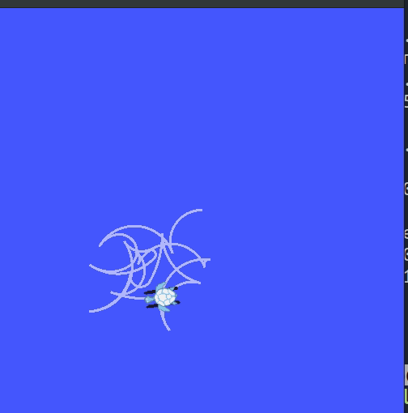
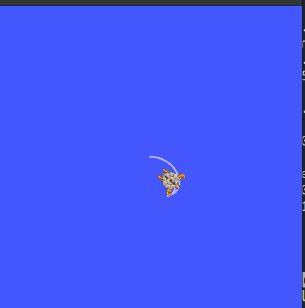


The final position is predicted correctly except when the turtles touches the walls.
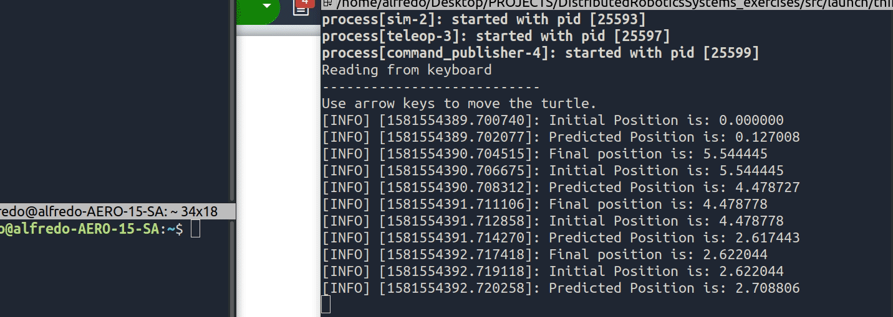


    


********************


### Exercise 4:

#### Launchfile instructions

To launch the code:
```
roslaunch dynamic_tutorials fourth_exercise.launch
```

The launchfile is the following:

```
<launch>
    <node pkg="turtlesim" type="turtlesim_node" name="sim"/>
    <node pkg="turtlesim" type="turtle_teleop_key" name="teleop" output="screen"/>
    <node name="command_publisher" pkg="dynamic_tutorials" type="turtle_baricenter.py" output="screen" clear_params="true" />
</launch>
```

It launches the random_controller.py executable.


#### Commenting the code

The structure of the code is very similar to the third exercise. New function are mainly utility function used to compute euclidean distances, angles between the baricenter and the turtle, and to publish messages in the right topic until a treshold condition is met:

```
    def compute_direction(self,x_bar,y_bar):
        self.angle=math.atan2(y_bar-self.pose.y, x_bar-self.pose.x)
        # print(self.angle)
        return self.angle

    def orient(self,angle):
        
        while (abs(self.pose.theta-angle)>0.01):
            self.vel_command.angular.z=(-self.pose.theta+angle)
            self.pub.publish(self.vel_command)
        self.pub.publish(self.null_command)
    
    def approach(self,x_bar,y_bar):
        self.dist=self.compute_distance(x_bar,y_bar)
        while (self.dist>0.1):
            self.dist=self.compute_distance(x_bar,y_bar)
            print(self.dist)
        # print(math.pow(float(math.pow((y-pose[i].y),2)+math.pow((x-pose[i].x),2)),2),'Distance')
            self.vel_command=self.null_command
            self.vel_command.linear.x=self.dist
            self.pub.publish(self.vel_command)
        # rospy.sleep(0.3)
        self.pub.publish(self.null_command)

    def action(self,x_bar,y_bar):
        print("ACTION")
        angle=self.compute_direction(x_bar,y_bar)
        self.orient(angle)    
        self.approach(x_bar,y_bar)
      
    def compute_distance(self,x_bar,y_bar):
        
        dist= ((self.pose.y-y_bar)**2+(self.pose.x-x_bar)**2)**1/2
        return dist
```


The big difference with respect to the previous exercises is that here two classes have been used. The first is a Turtle object, the second is a Turtle_baricenter object which is basically an object that contains n turtles and is able to compute the baricenter and use the turtles.action function to command them toward the goal.

```
class Turtle_baricenter():
    def __init__(self, number):
        rospy.init_node('turtlebot_controller')
        self.x_bar=0
        self.y_bar=0
        self.number=number
        self.turtles=[]
        for i in range (0, number):
            t1=Turtle('turtle'+ str(i))
            self.turtles.append(t1)
        self.rate = rospy.Rate(1)
 
    def compute_baricenter(self):
        rospy.wait_for_message('turtle0/pose',Pose)
        rospy.wait_for_message('turtle1/pose',Pose)
        rospy.wait_for_message('turtle2/pose',Pose)
        rospy.wait_for_message('turtle3/pose',Pose)
        
        self.x_bar=0
        self.y_bar=0
        for i in range (0,self.number):
            self.x_bar=self.x_bar+self.turtles[i].pose.x
            self.y_bar=self.y_bar+self.turtles[i].pose.y
            print(self.turtles[i].pose.x,self.turtles[i].pose.y)
        self.x_bar=self.x_bar/4
        self.y_bar=self.y_bar/4
        print("baricenter is:" ,self.x_bar,self.y_bar)

    def action(self):
        while not rospy.is_shutdown():
            for i in range (0,self.number):
                self.compute_baricenter()
                if (self.turtles[0].compute_distance(self.x_bar,self.y_bar)<0.1 and self.turtles[1].compute_distance(self.x_bar,self.y_bar) < 0.1 and self.turtles[2].compute_distance(self.x_bar,self.y_bar)< 0.1 and self.turtles[3].compute_distance(self.x_bar,self.y_bar)< 0.1 ):
                    break   
                self.turtles[i].action(self.x_bar,self.y_bar)
            self.rate.sleep()
```


In the main function these objects and their methods are called:
```
if __name__ == '__main__':

    try:
        tt= Turtle_baricenter(4)
        tt.compute_baricenter()
        tt.action()
    except rospy.ROSInterruptException:
        pass
```

#### Results

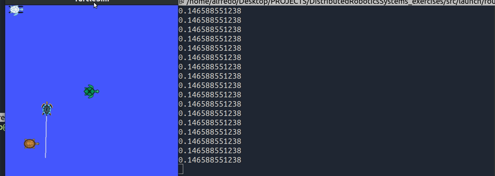

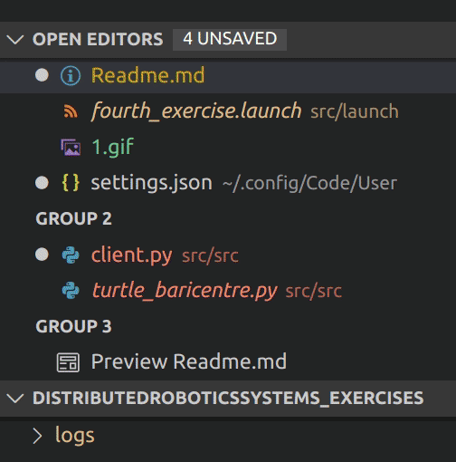

###### Note

I have deliberatedly chosen to control the steering first and then the linear velocity. In the fifth exercise I have combined the two commands in one.

********************


### Exercise 5: 


I have used the potential field method for navigating the turtle among obstacles.
To launch the node:

```
roslaunch dynamic_tutorials fifth_exercise.launch
```

The launchfile executes main.py.

#### Libraries used

Two libraries are used. The first is a TurtleBot library where the turtle class has been defined. The other two functions have been used for the artificial potential field method.

```
from libraries.apf import APF
from libraries.apf import Vector2d
from libraries.pid_controller import TurtleBot
```

The TurtleBot library extends the functionalities of the Turtle object seen in the exercise 4. The structure is equivalent. self.rospy.Rate(50) make sures that the frequency of the cmd is 50 hz as required

The Vector2d library is just a library that implements basic functionalities of 2d vector algebra: add, sub, mul, etc.

```
class Vector2d():

    def __init__(self, x, y):
        self.deltaX = x
        self.deltaY = y
        self.length = -1
        self.direction = [0, 0]
        self.vector2d_share()

    def vector2d_share(self):
        if type(self.deltaX) == type(list()) and type(self.deltaY) == type(list()):
            deltaX, deltaY = self.deltaX, self.deltaY
            self.deltaX = deltaY[0] - deltaX[0]
            self.deltaY = deltaY[1] - deltaX[1]
            self.length = math.sqrt(self.deltaX ** 2 + self.deltaY ** 2) * 1.0
            if self.length > 0:
                self.direction = [self.deltaX / self.length, self.deltaY / self.length]
            else:
                self.direction = None
        else:
            self.length = math.sqrt(self.deltaX ** 2 + self.deltaY ** 2) * 1.0
            if self.length > 0:
                self.direction = [self.deltaX / self.length, self.deltaY / self.length]
            else:
                self.direction = None

    def __add__(self, other):
        """
        :param other:
        :return:
        """
        vec = Vector2d(self.deltaX, self.deltaY)
        vec.deltaX += other.deltaX
        vec.deltaY += other.deltaY
        vec.vector2d_share()
        return vec

    def __sub__(self, other):
        vec = Vector2d(self.deltaX, self.deltaY)
        vec.deltaX -= other.deltaX
        vec.deltaY -= other.deltaY
        vec.vector2d_share()
        return vec

    def __mul__(self, other):
        vec = Vector2d(self.deltaX, self.deltaY)
        vec.deltaX *= other
        vec.deltaY *= other
        vec.vector2d_share()
        return vec

    def __truediv__(self, other):
        return self.__mul__(1.0 / other)

    def __repr__(self):
        return 'Vector deltaX:{}, deltaY:{}, length:{}, direction:{}'.format(self.deltaX, self.deltaY, self.length,
          
```
#### Potential field method

The APF is the real implementation of the potential field method studied in the course. An attractive and a repulsive potentials are defined, the potentials are computed for a grid and summed to obtain the total potential. The computed path just follows the minima of the gradient of the potential field.


```
class APF():
    """
    """

    def __init__(self, start: (), goal: (), obstacles: [], k_att: float, k_rep: float, rr: float,
                 step_size: float, max_iters: int, goal_threshold: float, is_plot=False):
        """
        :param start: 
        :param goal: 
        :param obstacles: 
        :param k_att: 
        :param k_rep: 
        :param rr: 
        :param step_size: 
        :param max_iters: 
        :param goal_threshold: 
        :param is_plot: 
        """
        self.start = Vector2d(start[0], start[1])
        self.current_pos = Vector2d(start[0], start[1])
        self.goal = Vector2d(goal[0], goal[1])
        self.obstacles = [Vector2d(OB[0], OB[1]) for OB in obstacles]
        self.k_att = k_att
        self.k_rep = k_rep
        self.rr = rr  
        self.step_size = step_size
        self.max_iters = max_iters
        self.iters = 0
        self.goal_threashold = goal_threshold
        self.path = list()
        self.is_path_plan_success = False
        self.is_plot = is_plot
        self.delta_t = 0.01

    def attractive(self):
        """
        
        :return: 
        """
        att = (self.goal - self.current_pos) * self.k_att  
        return att

    def repulsion(self):
        """
        
        :return: 
        """
        rep = Vector2d(0, 0)  
        for obstacle in self.obstacles:
            t_vec = self.current_pos - obstacle
            if (t_vec.length > self.rr):  
                pass
            else:
                rep += Vector2d(t_vec.direction[0], t_vec.direction[1]) * self.k_rep * (
                        1.0 / t_vec.length - 1.0 / self.rr) / (t_vec.length ** 2)  
        return rep

    def path_plan(self):
        """
        path plan
        :return:
        """
        while (self.iters < self.max_iters and (self.current_pos - self.goal).length > self.goal_threashold):
            f_vec = self.attractive() + self.repulsion()
            self.current_pos += Vector2d(f_vec.direction[0], f_vec.direction[1]) * self.step_size
            self.iters += 1
            self.path.append([self.current_pos.deltaX, self.current_pos.deltaY])
        if (self.current_pos - self.goal).length <= self.goal_threashold:
            self.is_path_plan_success = True

```

#### The Potential field parameters

The actual code consist in a sample function that given some obstacles compute a path based on the APF function and shows it on matplotlib. Once we are ok with the compute path, we can close the matplotlib interface and the turtle will go on to perform the computed path. 

Many parameters can be chosen:

```


        """
        :param start: 
        :param goal: 
        :param obstacles: 
        :param k_att: 
        :param k_rep: 
        :param rr: 
        :param step_size: 
        :param max_iters: 
        :param goal_threshold: 
        :param is_plot: 
        """
        
k_att, k_rep = 1.0, 100.0
    rr = 3
    step_size, max_iters, goal_threashold = .2, 500, .2 
    step_size_ = 2
    start, goal = (0, 0), (10,10)
    
    rd= 1+8*np.random.rand(12)

    obs = [[rd[0],rd[1]], [rd[2], rd[3]],[rd[4],rd[5]], [rd[6],rd[7]],[rd[8],rd[9]],[rd[10],rd[11]]]

```
This parameters have influences on the shape of the potential field, the radius of influcence of the repulsive fields, the step size, the treshold to reach the goal, the position and number of initial obstacles.


The main function first computes and displays the path and the obstacles and then proceeds to command the turtle to execute the given path.

```
# Main function.
if __name__ == '__main__':
    
    path= sample_path()
    try:
        tt=TurtleBot()
        tt.teleport()
        tt.move2goal(path,0.1)
    except rospy.ROSInterruptException:
        pass
```
#### Results

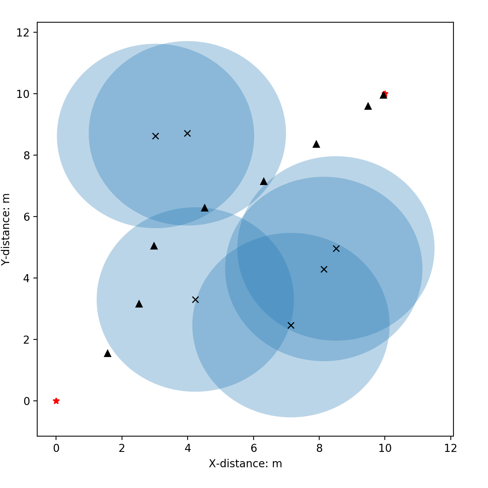

The first line is the trace to get from the initial position to (0,0)
 
The starting point is chosen to be (0,0) just to have more space for computing the path and inserting obstacles.
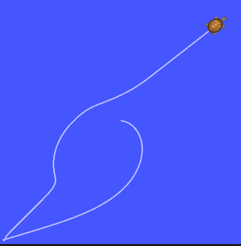


Another example of successful path planning

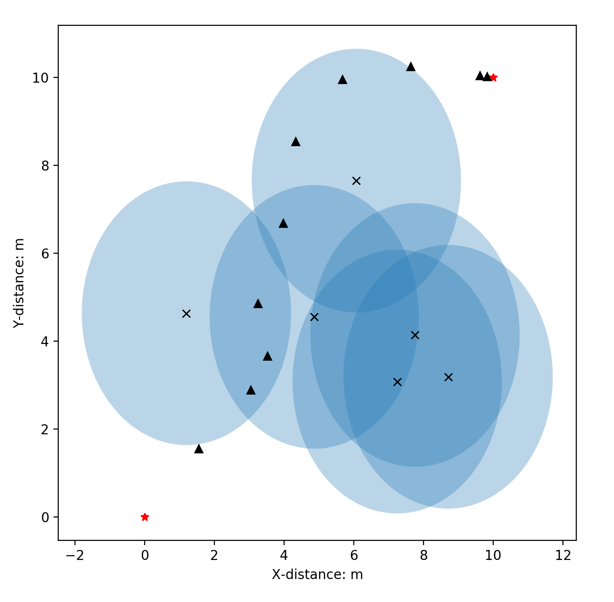


There are cases where the path planning algorithm fails: 
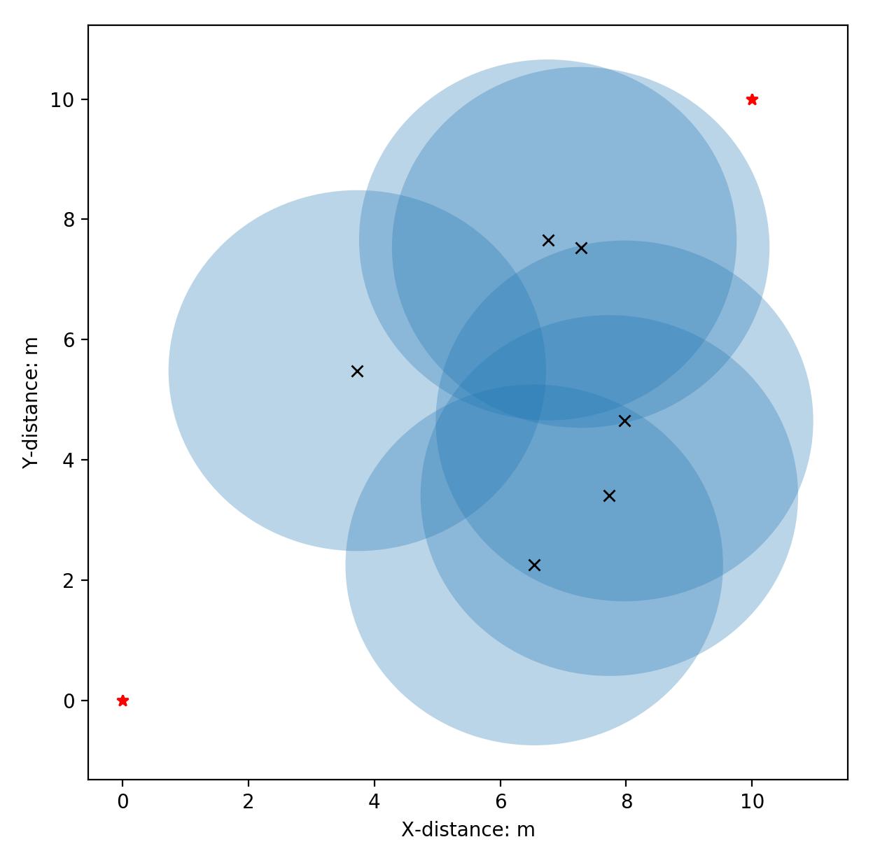

This is due to how the APF algorithm has been implemented and depends of course on how many obstacles are there and how repulsive they are with respect to the goal.


### Note:  building the package

Sometimes catkin build or catkin_make give some problems with CMake variables not declared. In that case just run catkin build / make twice and it will build succesfully.

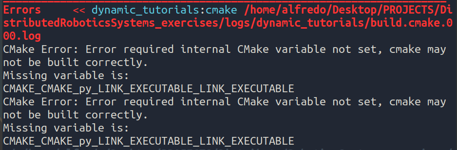

Just execute catkin build again:

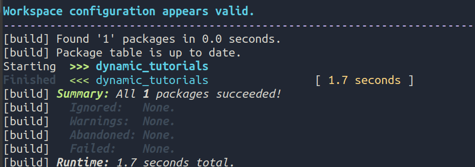